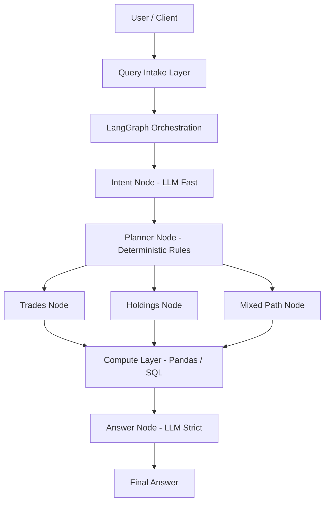

# LLM-Driven Query Orchestration System

This document describes a deterministic, auditable, LLM-assisted query orchestration system designed for numerical correctness, explainability, and controlled execution.

---

## 1. System Overview

### Primary Goal

Safely answer user questions over financial / analytical data with:

- deterministic computation
- strict routing
- zero hallucinated numbers

### Core Principles

- LLMs reason and plan, never calculate
- All math happens in code
- Every node is observable and fail-closed

---

## 2. High-Level Architecture (ASCII)

```
                                                                          ┌──────────────────────────────────────────────────────────────┐
                                                                          │                         USER / CLIENT                        │
                                                                          │              (Natural Language Question)                     │
                                                                          └──────────────────────────────────────────────────────────────┘
                                                                                                          │
                                                                                                          ▼
                                                                          ┌──────────────────────────────────────────────────────────────┐
                                                                          │                    QUERY INTAKE LAYER                        │
                                                                          │            (Input validation, logging)                       │
                                                                          └──────────────────────────────────────────────────────────────┘
                                                                                                          │
                                                                                                          ▼
                                                                          ┌──────────────────────────────────────────────────────────────┐
                                                                          │                  LANGGRAPH ORCHESTRATION                     │
                                                                          │              (State Machine / Control Plane)                 │
                                                                          │                                                              │
                                                                          │   ┌───────────────┐                                          │
                                                                          │   │  Intent Node  │  ← LLM (Fast)                            │
                                                                          │   └───────────────┘                                          │
                                                                          │            │                                                 │
                                                                          │            ▼                                                 │
                                                                          │   ┌────────────────┐                                         │
                                                                          │   │ Planner Node   │  ← Deterministic + Rules                │
                                                                          │   └────────────────┘                                         │
                                                                          │      │         │           │                                 │
                                                                          │      ▼         ▼           ▼                                 │
                                                                          │ ┌────────┐ ┌──────────┐ ┌────────────┐                       │
                                                                          │ │ Trades │ │ Holdings │ │ Mixed Path │                       │
                                                                          │ │ Node   │ │ Node     │ │ (Cross Meta)│                      │
                                                                          │ └────────┘ └──────────┘ └────────────┘                      │
                                                                          │      │         │           │                                 │
                                                                          │      └──────┬──┴───────┬───┘                                 │
                                                                          │             ▼          ▼                                     │
                                                                          │        ┌──────────────────────┐                              │
                                                                          │        │     COMPUTE LAYER     │                             │
                                                                          │        │  (Pandas / SQL Logic) │                             │
                                                                          │        └──────────────────────┘                              │
                                                                          │                      │                                       │
                                                                          │                      ▼                                       │
                                                                          │           ┌───────────────────────┐                          │
                                                                          │           │      ANSWER NODE       │  ← LLM (Strict)         │
                                                                          │           └───────────────────────┘                          │
                                                                          └──────────────────────────────────────────────────────────────┘
                                                                                                          │
                                                                                                          ▼
                                                                          ┌──────────────────────────────────────────────────────────────┐
                                                                          │                         FINAL ANSWER                         │
                                                                          │       (Exact numbers OR safe failure message)                │
                                                                          └──────────────────────────────────────────────────────────────┘
```

---

## 3. Mermaid Diagram



---

## 4. Failure Philosophy

Fail closed, not creative.

If any of the following occur:
- intent confidence too low
- planner cannot route
- compute returns empty or invalid
- answer node detects mismatch

The system responds with:

```
Sorry, I cannot find the answer to this question with available data.
```

---

## 5. Summary

This architecture:
- Treats LLMs as reasoning components, not authorities
- Preserves numerical correctness
- Is auditable, testable, and production-safe
- Scales cleanly across domains
