# Financial RAG System

> End-to-end Retrieval Augmented Generation (RAG) architecture designed to answer financial questions using validated trade and holdings datasets.

The system converts structured financial data into semantic embeddings, indexes them using FAISS, and retrieves grounded answers through a deterministic query pipeline.

The system is divided into **two major macro pipelines**:

1. **Offline Build Pipeline**  
   Converts financial datasets into vector indexes.

2. **Online Query Pipeline**  
   Processes user queries and retrieves context grounded answers.

The architecture ensures that answers are **traceable, deterministic, and safe for financial data usage**.

---

# Overview

Financial datasets such as **trade logs and portfolio holdings** contain valuable insights but are difficult to query using natural language.

Traditional systems require knowledge of **SQL, schemas, and database structures**, which limits accessibility.

This system solves that problem by enabling **natural language querying over financial data** while maintaining strict numerical accuracy.

Instead of allowing LLM hallucinations, the system follows a strict architecture:

1. Load financial CSV datasets
2. Validate schemas and enforce data discipline
3. Convert rows into semantic descriptions
4. Generate embeddings
5. Reduce dimensions using PCA
6. Build FAISS vector indexes
7. Detect user query intent
8. Retrieve relevant records
9. Generate answers using retrieved context only

The result is a **high-precision financial question answering system**.

---

# Key Features

- Deterministic Retrieval Augmented Generation architecture
- Schema validation for financial datasets
- Semantic row serialization for structured financial records
- Batch optimized embedding generation
- PCA dimensionality reduction
- FAISS IVF + Product Quantization indexing
- Query intent detection and routing
- Redis semantic caching
- Context reconstruction from original CSV rows
- Strict guardrails to prevent hallucinated answers
- Modular offline and online pipelines

---

# System Architecture

The complete system consists of **two macro pipelines**.


```mermaid
flowchart LR

A["Raw Financial Data"] --> B["Schema Validation"]
B --> C["Semantic Serialization"]
C --> D["Embedding Generation"]
D --> E["PCA Reduction"]
E --> F["FAISS Index Creation"]

F --> G["Query Pipeline"]

G --> H["Semantic Cache"]
H --> I["Intent Detection"]
I --> J["Query Embedding"]
J --> K["Vector Search"]
K --> L["Context Reconstruction"]
L --> M["Answer Generation"]
```

---

# Offline Build Pipeline

The offline pipeline converts raw financial datasets into optimized vector indexes.

This pipeline runs **once during initialization or dataset refresh**.

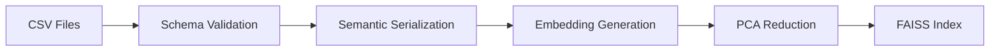
```mermaid
flowchart LR

CSV["CSV Files"]
Validate["Schema Validation"]
Serialize["Semantic Serialization"]
Embed["Embedding Generation"]
PCA["PCA Reduction"]
Index["FAISS Index"]

CSV --> Validate
Validate --> Serialize
Serialize --> Embed
Embed --> PCA
PCA --> Index
```

---

# Raw Data Ingestion

Financial datasets are loaded from CSV files.

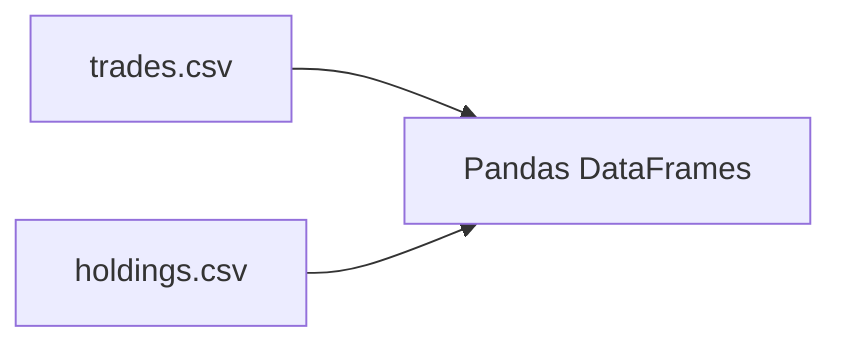
```mermaid
flowchart LR

Trades["trades.csv"]
Holdings["holdings.csv"]
Pandas["Pandas DataFrames"]

Trades --> Pandas
Holdings --> Pandas
```

### Data Sources

| Dataset | Description |
|---|---|
| trades.csv | Contains trade execution records |
| holdings.csv | Contains portfolio holding positions |

These datasets act as the **source of truth** for the system.

No LLM interaction occurs at this stage.

---

# Schema Validation Layer

Before generating embeddings, the system validates financial data.

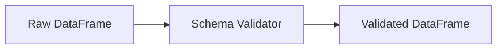
```mermaid
flowchart LR

Raw["Raw DataFrame"]
Validator["Schema Validator"]
Clean["Validated DataFrame"]

Raw --> Validator
Validator --> Clean
```

### Validation Checks

| Validation | Purpose |
|---|---|
| Mandatory columns | Ensure required financial fields exist |
| Date parsing | Validate TradeDate and AsOfDate |
| Numeric enforcement | Validate Quantity, Price, Market Value |
| Null detection | Prevent incomplete records |
| Price checks | Detect invalid financial values |

### Invalid Trade Handling

Trades with invalid price values are quarantined.

```
Price ≤ 0
      ↓
trades_quarantine.csv
```

This ensures corrupted records **never enter the embedding pipeline**.

---

# Semantic Serialization Layer

Structured rows are converted into **semantic sentences**.

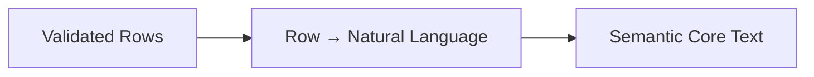
```mermaid
flowchart LR

Rows["Validated Rows"]
Transform["Row → Natural Language"]
Text["Semantic Core Text"]

Rows --> Transform
Transform --> Text
```

### Example (Trade Row)

```
Trade event on 2024-01-15 for AlphaFund:
BUY 100 units of AAPL at price 187.5 strategy Momentum
```

### Example (Holding Row)

```
Holding position as of 2024-01-31 for AlphaFund:
Held 250 units of AAPL valued at 46875 with YTD P&L 4200
```

This transformation enables **semantic vector search over tabular data**.

---

# Embedding Generation

Semantic sentences are converted into vector embeddings.

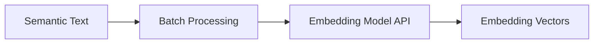
```mermaid
flowchart LR

Text["Semantic Text"]
Batch["Batch Processing"]
API["Embedding Model API"]
Vectors["Embedding Vectors"]

Text --> Batch
Batch --> API
API --> Vectors
```

### Optimizations

- Batch size control
- Retry with exponential backoff
- Dummy vectors for alignment safety

Embeddings are stored in:

```
vectors/float/
├── trades_embeddings.pkl
└── holdings_embeddings.pkl
```

---

# Dimensionality Reduction (PCA)

High dimensional embeddings are compressed using PCA.


```mermaid
flowchart LR

Emb768["768-D Embeddings"]
PCA["FAISS PCA Training"]
Emb256["256-D Embeddings"]

Emb768 --> PCA
PCA --> Emb256
```

The PCA transform is saved as:

```
vectors/pca_transform.faiss
```

---

# Vector Indexing (FAISS)

Optimized vector indexes are created using FAISS.

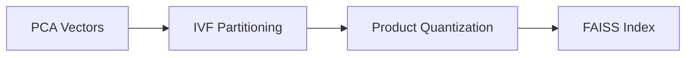
```mermaid
flowchart LR

Vectors["PCA Vectors"]
IVF["IVF Partitioning"]
PQ["Product Quantization"]
Index["FAISS Index"]

Vectors --> IVF
IVF --> PQ
PQ --> Index
```

### Index Parameters

| Parameter | Value |
|---|---|
| IVF clusters | 64 |
| PQ segments | 32 |
| Quantization | 8 bit |

Separate indexes are built for each dataset.

```
vectors/
├── trades_index/index_pq.faiss
└── holdings_index/index_pq.faiss
```

---

# Online Query Pipeline

The online pipeline runs **per user query**.

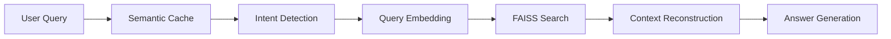
```mermaid
flowchart LR

Query["User Query"]
Cache["Semantic Cache"]
Intent["Intent Detection"]
Embed["Query Embedding"]
Search["FAISS Search"]
Context["Context Reconstruction"]
Answer["Answer Generation"]

Query --> Cache
Cache --> Intent
Intent --> Embed
Embed --> Search
Search --> Context
Context --> Answer
```

---

# Semantic Cache Layer

The system checks Redis before performing expensive operations.


```mermaid
flowchart LR

Query["Query"]
Hash["Query Hash"]
Redis["Redis Cache"]

Query --> Hash
Hash --> Redis
```

### Cached Artifacts

- Query embeddings
- Generated answers

---

# Intent Detection

Queries are classified to determine which dataset should be searched.

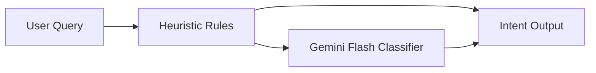
```mermaid
flowchart LR

Query["User Query"]
Rules["Heuristic Rules"]
LLM["Gemini Flash Classifier"]
Intent["Intent Output"]

Query --> Rules
Rules --> Intent
Rules --> LLM
LLM --> Intent
```

### Supported Intents

| Intent | Description |
|---|---|
| TRADE_ONLY | Query relates to trades |
| HOLDING_ONLY | Query relates to holdings |
| MIXED | Query requires both datasets |
| UNSUPPORTED | Query cannot be answered |

---

# Query Embedding

User queries are embedded and projected to the same vector space.

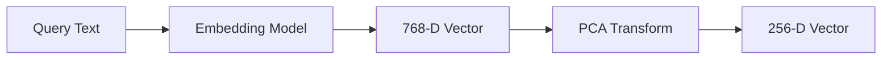
```mermaid
flowchart LR

Query["Query Text"]
Embed["Embedding Model"]
Vector768["768-D Vector"]
PCA["PCA Transform"]
Vector256["256-D Vector"]

Query --> Embed
Embed --> Vector768
Vector768 --> PCA
PCA --> Vector256
```

---

# FAISS Retrieval

Relevant financial rows are retrieved using vector similarity search.

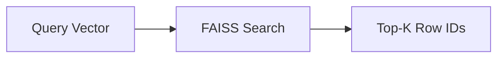
```mermaid
flowchart LR

QueryVector["Query Vector"]
FAISS["FAISS Search"]
Results["Top-K Row IDs"]

QueryVector --> FAISS
FAISS --> Results
```

Search parameters:

| Parameter | Value |
|---|---|
| nprobe | 8 |
| retrieval | top-K results |

---

# Context Reconstruction

Retrieved row IDs are mapped back to the original CSV rows.

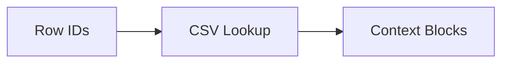
```mermaid
flowchart LR

IDs["Row IDs"]
Lookup["CSV Lookup"]
Context["Context Blocks"]

IDs --> Lookup
Lookup --> Context
```

This guarantees that answers always reference **real financial records**.

---

# Answer Generation

The final answer is generated using strict RAG prompting.

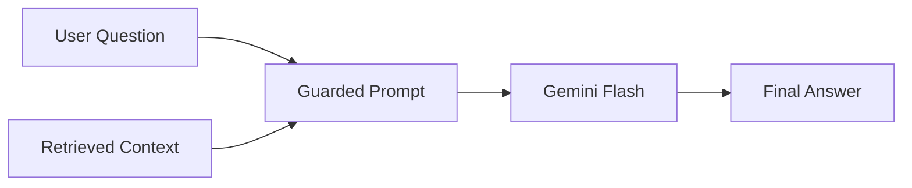
```mermaid
flowchart LR

Question["User Question"]
Context["Retrieved Context"]
Prompt["Guarded Prompt"]
LLM["Gemini Flash"]
Answer["Final Answer"]

Question --> Prompt
Context --> Prompt
Prompt --> LLM
LLM --> Answer
```

### Guardrail Rule

If relevant context is missing:

```
Sorry can not find the answer
```

No guessing is allowed.

---

# Final System Architecture

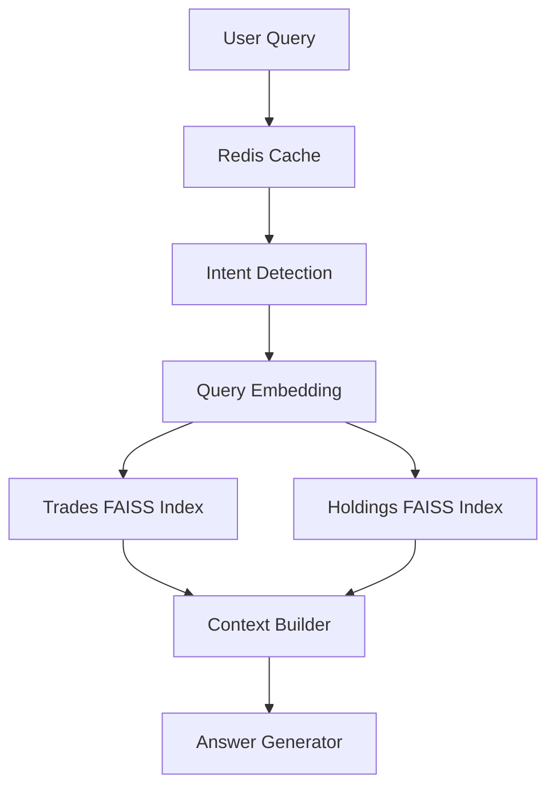
```mermaid
graph TD

User["User Query"]

Cache["Redis Cache"]
Intent["Intent Detection"]
Embed["Query Embedding"]

SearchTrades["Trades FAISS Index"]
SearchHoldings["Holdings FAISS Index"]

Context["Context Builder"]
Answer["Answer Generator"]

User --> Cache
Cache --> Intent
Intent --> Embed
Embed --> SearchTrades
Embed --> SearchHoldings
SearchTrades --> Context
SearchHoldings --> Context
Context --> Answer
```

---

# Tech Stack

| Category | Technology |
|---|---|
| Programming Language | Python |
| Data Processing | Pandas |
| Vector Search | FAISS |
| Embeddings | Gemini Embedding API |
| LLM | Gemini Flash |
| Cache | Redis |
| Storage | CSV |
| Vector Storage | FAISS Index |
| Dimensionality Reduction | PCA |

---

# Project Structure

```
financial-rag-system

data/
    trades.csv
    holdings.csv
    trades_quarantine.csv

vectors/
    float/
        trades_embeddings.pkl
        holdings_embeddings.pkl

    trades_index/
        index_pq.faiss

    holdings_index/
        index_pq.faiss

    pca_transform.faiss

pipeline/

    offline/
        ingest_data.py
        validate_schema.py
        semantic_serializer.py
        embedding_generator.py
        pca_trainer.py
        index_builder.py

    online/
        query_cache.py
        intent_router.py
        query_embedder.py
        faiss_search.py
        context_builder.py
        answer_generator.py

utils/
    logger.py
    retry.py
    hashing.py

main.py
requirements.txt
README.md
```

---

# Running the System

Install dependencies:

```
pip install -r requirements.txt
```

Run the offline build pipeline:

```
python pipeline/offline/build_index.py
```

Start the query system:

```
python main.py
```

---

# Engineering Principles

- Deterministic architecture
- Traceable answers
- No hallucination pathways
- Strict financial data discipline
- Efficient retrieval pipeline
- Separation of offline and online workloads

---

# Mental Model

```
LLMs talk
FAISS searches
Pandas computes
Rules decide
```

---

# Author

Shaktesh Pandey  
GitHub: https://github.com/shaktiap1
